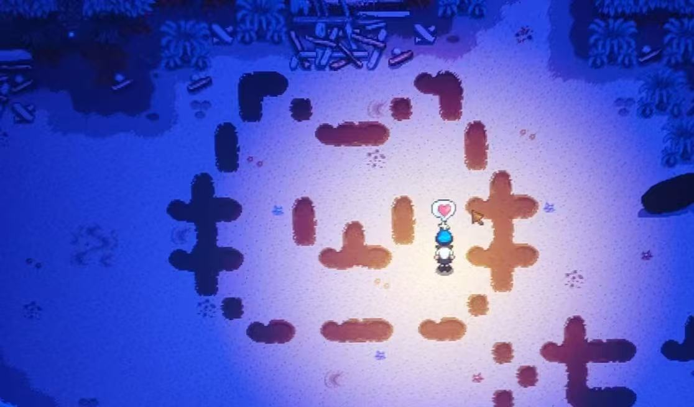

### Hey ，I’m DemonWhite

<table>
<tr>
<td valign="center"  width="30%">

- 💬 我最喜欢的游戏：星露谷物语
- 👨‍💻 我了解C++、Unity(C#),计算机图形学，等等...
- ✍️ [欢迎参观我的博客](https://www.demonwhite.xyz/)
- 🤖 [点这里访问我的itch主页](https://demonwhite.itch.io/)
- 📫 联系我: [邮箱联系](mailto:NKUyhr@163.com)
- 🎣 兴趣：游戏，绘画，创作
- 📺 [我的BiliBili主页](https://space.bilibili.com/454833986?spm_id_from=333.1007.0.0)

</td>
<td valign="center" width="100%" height="100%">

</td>
</tr>
</table>

🏆 **我的 GitHub 统计信息:**

|||
|-|-|

<table>
<tr>
<td valign="center"  width="50%">

#### 🐍 贡献
<picture>
  <source media="(prefers-color-scheme: dark)" srcset="https://raw.githubusercontent.com/rento666/rento666/output/github-contribution-grid-snake-dark.svg">
  <source media="(prefers-color-scheme: light)" srcset="https://raw.githubusercontent.com/rento666/rento666/output/github-contribution-grid-snake.svg">
  
</picture>

</td>
<td valign="center"  width="50%">

📕 &nbsp;[**我的最新博客**](https://www.demonwhite.xyz/)
<!-- BLOG-POST-LIST:START -->
<!-- BLOG-POST-LIST:END -->

</td>
</tr>

</table>
<tr>
<td valign="center"  width="60%">
  :computer: Programming languages and tools :computer:

   

<code></code>
<code></code>
<code></code>
 
<code></code>
<code></code>
<code></code>
 
<code></code>
<code></code>
<code></code>
 
<code></code>
<code></code>
<code></code>

</td>

</tr>

